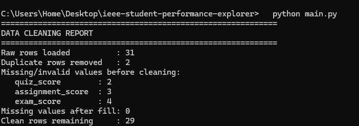
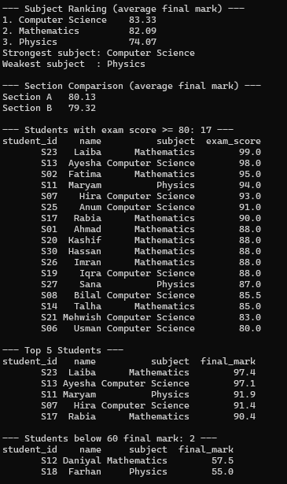

# Student Performance Explorer

### IEEE LGU AI/ML Cohort One — Fall 2026

**Week 3 Assignment:** Data Analysis with NumPy & Pandas
**AI/ML Leads:** Abdullah Faisal & Alina Irshad

---

## 1. Project Overview

This project analyzes student assessment records (quiz, assignment and exam scores) across three subjects and two sections. The script cleans missing and invalid marks, calculates a weighted final mark, computes class statistics with NumPy, and compares subjects and sections using Pandas `groupby`.

## 2. Key Concepts Implemented

- [x] Pandas DataFrame Loading & Cleaning (`read_csv`, `fillna`, `dropna`, `drop_duplicates`)
- [x] NumPy Statistical Calculations (Mean, Median, Standard Deviation, Min, Max)
- [x] Data Grouping & Aggregation (`groupby`)
- [x] Conditional Filtering & Indexing (exam score >= 80, final mark < 60)
- [ ] Dataset Merging / Time-Series Resampling (not required for this project)

## 3. How to Run the Program

```shell
pip install pandas numpy
python main.py
```

## 4. Dataset Information & Cleaning Decisions

* **Data Source:** `data/students.csv` was created by me for this assignment (31 rows). It intentionally contains missing scores, text values and duplicates, based on the example in the assignment. All data is read with `pandas.read_csv()`; nothing is hardcoded.
* **Duplicates:** The same student can appear twice with a different `student_id` (e.g. S01 and S05 are both Ahmad with identical scores). Duplicates are detected by comparing all columns **except** `student_id`. 2 duplicate rows were removed.
* **Invalid scores:** Text like `abc` / `xyz` was converted to missing values with `pd.to_numeric(errors="coerce")`. Scores outside 0–100 would also be marked missing.
* **Missing scores:** Filled with the **median score of the same subject**. The median was chosen over the mean because it is not distorted by a few very high or very low marks, and using the same subject keeps the fill value fair.
* **Final mark:** Weighted average = Quiz 20% + Assignment 30% + Exam 50%, calculated with NumPy matrix multiplication.
* **Result:** 31 raw rows → 29 clean rows.

## 5. Console Output Screenshots

**Data cleaning output:**



**Summary report:**


